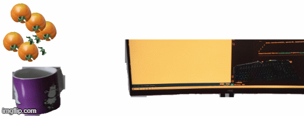
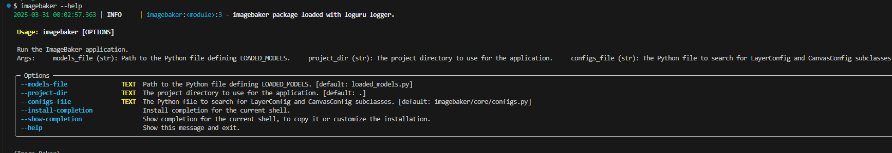
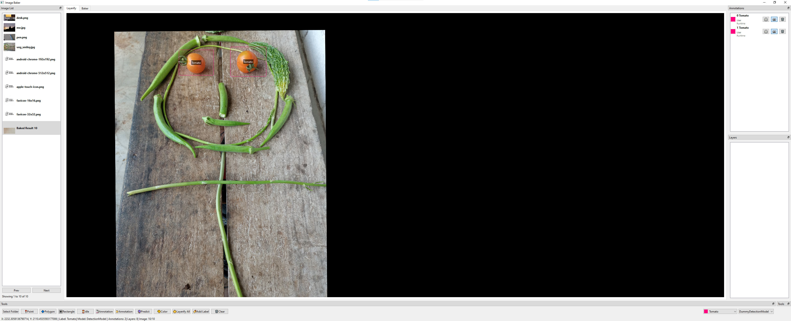
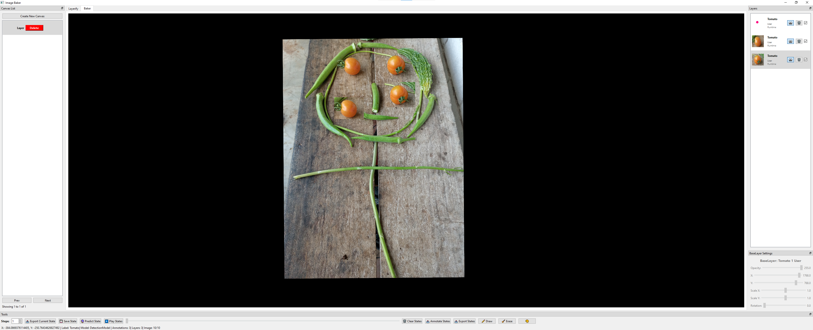
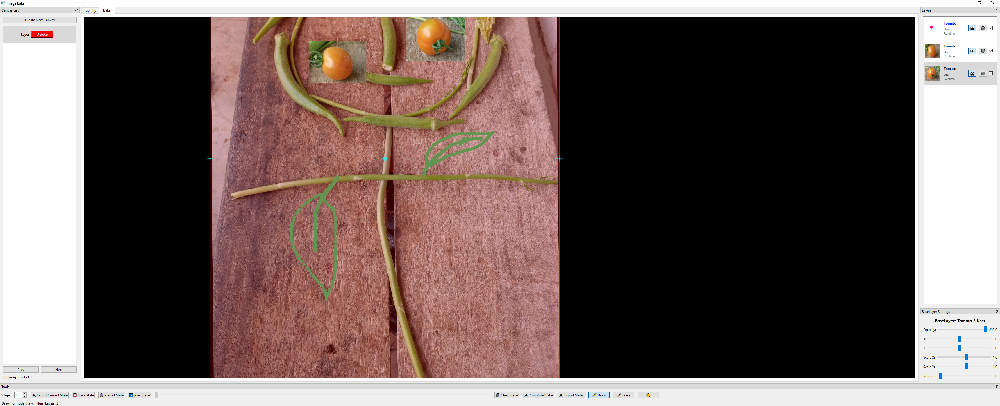

# Image-Baker


<!--  -->


<p align="center">
    
</p>


*An example of baked images. (Each object is a layer and an annotation will also be extracted for all layers.)*

Let's bake an image.

## Why is it relevant?

When training computer vision models (especially for detection and segmentation), labeling large amounts of data is crucial for better model performance. Often, the process involves multiple cycles of labeling, training, and evaluation. By generating multiple realistic labeled datasets from a single image, the time spent on labeling can be significantly reduced.

## What's up with the name?
The concept involves extracting portions of an image (e.g., objects of interest) using tools like polygons or models such as Segment Anything. These extractions are treated as layers, which can then be copied, pasted, and manipulated to create multiple instances of the desired object. By combining these layers step by step, a new labeled image with annotations in JSON format is created. The term "baking" refers to the process of merging these layers into a single cohesive image.

## Getting Started
### Installation
#### Using PIP
This project is also available on the PyPI server.

```bash
pip install imagebaker
```

#### Developing
Please, clone this repository and install it locally:

```bash
git clone https://github.com/q-viper/image-baker.git 
cd image-baker
pip install -e .
```

### First Run
Run the following command to launch the GUI:

`imagebaker`

By default, the above command will not run any models on the backend. So please take a look into the example of model definition at [examples/loaded_models.py](examples/loaded_models.py). Then we need to pass it as:

`imagebaker --models-file examples/loaded_models.py`

For more options, please do: `imagebaker --help` It should give the following options.




* **`--configs-file`** allows us to define custom configs. The custom configs have to inherit LayerConfig and CanvasConfig defined at [imagebaker/core/configs/configs.py](imagebaker/core/configs/configs.py). An example is available at [examples](examples/). 

After cloning and going to the project directory, the following code should work.
`imagebaker --models-file examples/loaded_models.py --configs-file examples/example_config.py`

## Features
- **Annotating Images**: Load a folder of images and annotate them using bounding boxes or polygons.
- **Model Testing**: Define models for detection, segmentation, and prompts (e.g., points or rectangles) by following the base model structure in [imagebaker/models/base_model.py](imagebaker/models/base_model.py). See [examples/loaded_models.py](examples/loaded_models.py) for a working example.
- **Layerifying**: Crop images based on annotations to create reusable layers. Each cropped image represents a single layer.
- **Baking States**: Arrange layers to create image variations by dragging, rotating, adjusting opacity, and more. Save the state using the Save State button or Ctrl + S.
- **Playing States**: Replay saved states, export them locally, or use them for further predictions.
- **Exporting States**: Export the final annotated JSON and the baked multilayer image.

### Shortcuts
* **Ctrl + C**: Copy selected annotation/layer.
* **Ctrl + V**: Paste copied annotation/layer in its parent image/layer if it is currently open.
* **Delete**: Delete selected annotation/layer.
* **Left Click**: Select an annotation/layer on mouse position.
* **Left Click + Drag**: Drag a selected annotation/layer.
* **Double Left Click**: When using polygon annotation, completes the polygon.
* **Right Click**: Deselect an annotation/layer. While annotating the polygon, undo the last point.
* **Ctrl + Mouse Wheel**: Zoom In/Out on the mouse position, i.e., resize the viewport.
* **Ctrl + Drag**: If done on the background, the viewport is panned.
* **Ctrl + S**: Save State on Baker Tab.
* **Ctrl + D**: Draw Mode on Baker Tab. Drawing can happen on a selected or main layer.
* **Ctrl + E**: Erase Mode on Baker Tab.
* **Wheel**: Change the size of the drawing pointer.

## Demo
### Annotation Page
This is where the loading of the image folder and annotation, connection with the model running in the backend, and layerifying happen.



### Baker Page
This is where the layer baking happens. And the extraction of the layers as well.



An example of drawing:



### Annotated

The JSON and the baked image will be exported to the local folder, and in debug mode, the annotations and the mask for each layer will be exported too.


### Demo Video

To see the tool in action, check out the demo video below:


[](https://youtu.be/WckMT0r-2Lc)


Click on the image above to play the video on YouTube.


## Contributions


Contributions are welcome! 

Do you find this project to be useful and are you looking for some features that are not implemented yet? Feel free to open issues or submit pull requests to improve the project.