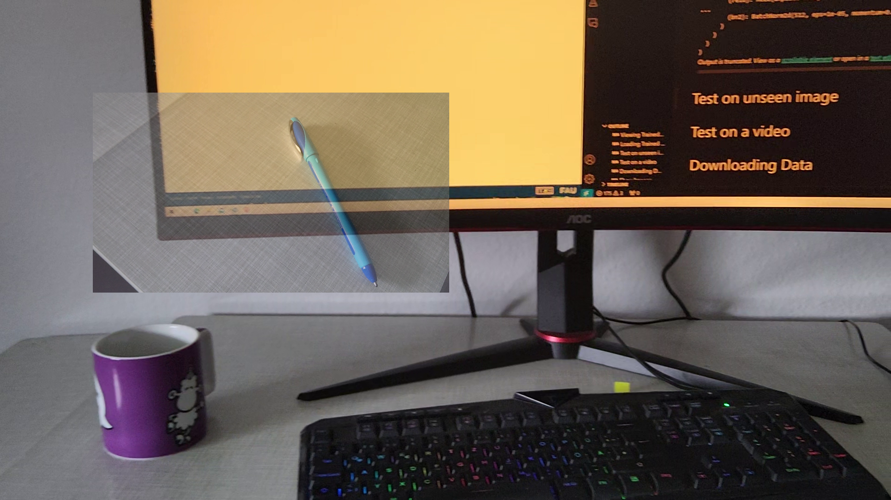
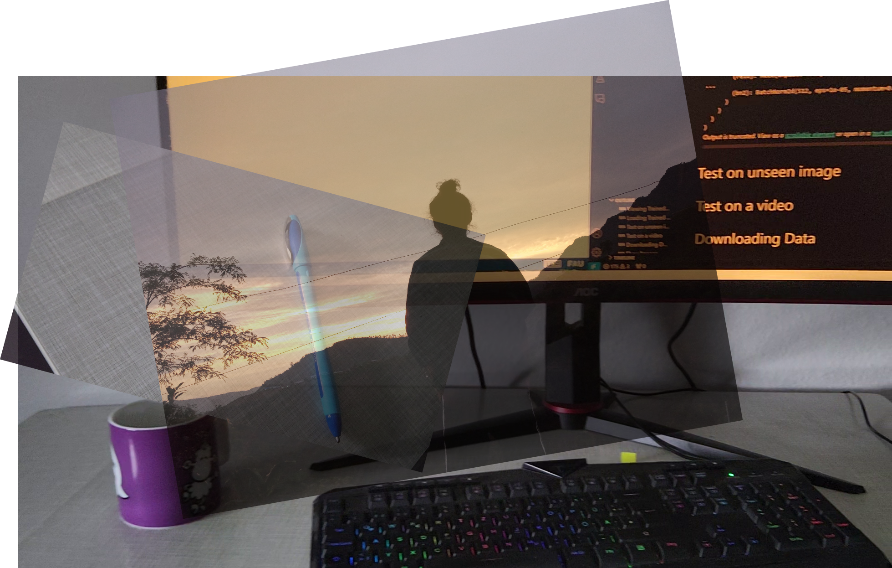
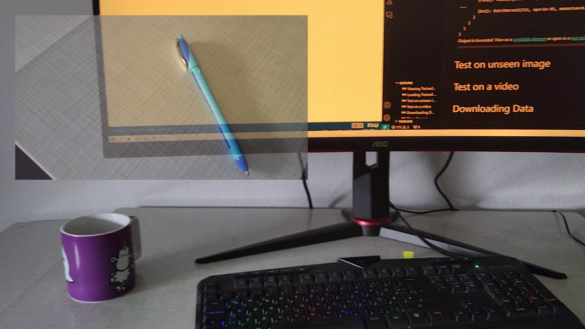

# ImageBaker API Documentation

ImageBaker can now be used in three ways:
1. **GUI Application** - The traditional visual interface
2. **CLI Tool** - Command-line interface for automation
3. **Python Library** - Programmatic API for integration

## Installation

```bash
# Install from PyPI
pip install imagebaker

# Or install from source for development
git clone https://github.com/q-viper/image-baker.git
cd image-baker
pip install -e .
```

## Quick Start

### As a Python Library

```python
from imagebaker import ImageBaker, create_annotation, AnnotationType

# Create a baker instance
baker = ImageBaker()

# Add layers
layer1 = baker.add_layer_from_file("background.png")
layer2 = baker.add_layer_from_file("foreground.png")

# Position and style layers
baker.set_layer_position(layer2, x=100, y=100)
baker.set_layer_opacity(layer2, 0.7)
baker.set_layer_scale(layer2, 0.5)
baker.set_layer_rotation(layer2, 45)

# Add annotations
ann = create_annotation(
    label="person",
    annotation_type=AnnotationType.RECTANGLE,
    coordinates=[(50, 50), (150, 150)],
    color=(255, 0, 0)
)
baker.add_annotation(layer2, ann)

# Bake and save
result = baker.bake()
baker.save(result, "output.png", save_annotations=True)
```

### As a CLI Tool

```bash
# Launch GUI (traditional mode)
imagebaker gui --models-file examples/loaded_models.py

# Simple baking from command line
imagebaker bake simple bg.png fg.png -o output.png \
    --positions "0,0;100,100" \
    --opacities "1.0,0.5" \
    --scales "1.0,0.8"

# Bake from configuration file
imagebaker bake from-config config.py -o output.png

# Get image information
imagebaker info image.png

# Show version
imagebaker version
```

## Python API Reference

### ImageBaker Class

The main class for compositing images.

```python
from imagebaker import ImageBaker

baker = ImageBaker(config=None, output_dir=None)
```

**Constructor Parameters:**
- `config` (Optional[CanvasConfig]): Custom configuration
- `output_dir` (Optional[Path]): Directory for outputs (default: ./assets/exports)

#### Methods

##### add_layer_from_file
```python
layer_id = baker.add_layer_from_file(
    image_path: Union[str, Path],
    layer_name: Optional[str] = None,
    visible: bool = True,
    opacity: float = 1.0
) -> int
```

Add a layer from an image file.

**Returns:** Layer ID (index)

##### add_layer_from_array
```python
layer_id = baker.add_layer_from_array(
    image: np.ndarray,
    layer_name: Optional[str] = None,
    visible: bool = True,
    opacity: float = 1.0
) -> int
```

Add a layer from a numpy array.

**Returns:** Layer ID (index)

##### set_layer_position
```python
baker.set_layer_position(layer_id: int, x: float, y: float)
```

Set the position of a layer in pixels.

##### set_layer_rotation
```python
baker.set_layer_rotation(layer_id: int, rotation: float)
```

Set the rotation of a layer in degrees.

##### set_layer_scale
```python
baker.set_layer_scale(layer_id: int, scale_x: float, scale_y: Optional[float] = None)
```

Set the scale of a layer. If `scale_y` is None, uniform scaling is applied.

##### set_layer_opacity
```python
baker.set_layer_opacity(layer_id: int, opacity: float)
```

Set the opacity of a layer (0.0 = transparent, 1.0 = opaque).

##### set_layer_visibility
```python
baker.set_layer_visibility(layer_id: int, visible: bool)
```

Set whether a layer is visible.

##### add_annotation
```python
baker.add_annotation(layer_id: int, annotation: Annotation)
```

Add an annotation to a layer.

##### save_state
```python
baker.save_state(step: Optional[int] = None)
```

Save the current state of all layers. Useful for creating multiple variations.

##### bake
```python
result = baker.bake(
    step: Optional[int] = None,
    include_annotations: bool = True
) -> BakingResult
```

Composite all layers into a single image.

**Returns:** BakingResult with the composited image and annotations

##### save
```python
path = baker.save(
    result: BakingResult,
    output_path: Optional[Union[str, Path]] = None,
    save_annotations: bool = True
) -> Path
```

Save a baking result to disk.

**Returns:** Path to the saved image

##### bake_and_save
```python
path = baker.bake_and_save(
    output_path: Optional[Union[str, Path]] = None,
    step: Optional[int] = None
) -> Path
```

Convenience method to bake and save in one call.

**Returns:** Path to the saved image

##### get_layer_count
```python
count = baker.get_layer_count() -> int
```

Get the number of layers.

##### get_layer_info
```python
info = baker.get_layer_info(layer_id: int) -> Dict
```

Get information about a layer.

**Returns:** Dictionary with layer properties

### Annotations

#### create_annotation

```python
from imagebaker import create_annotation, AnnotationType

ann = create_annotation(
    label: str,
    annotation_type: AnnotationType,
    coordinates: List[Tuple[float, float]],
    color: Optional[Tuple[int, int, int]] = None,
    annotation_id: Optional[int] = None,
    score: Optional[float] = None,
    caption: str = ""
)
```

**Annotation Types:**
- `AnnotationType.POINT` - Point annotations
- `AnnotationType.RECTANGLE` - Bounding box annotations
- `AnnotationType.POLYGON` - Polygon annotations
- `AnnotationType.MASK` - Mask-based annotations

#### Convenience Functions

```python
from imagebaker.api.annotation import (
    rectangle_annotation,
    polygon_annotation,
    point_annotation
)

# Rectangle
ann = rectangle_annotation("person", x1=100, y1=100, x2=200, y2=200)

# Polygon
ann = polygon_annotation("object", [(10, 10), (50, 10), (50, 50), (10, 50)])

# Points
ann = point_annotation("keypoint", [(100, 100), (150, 150)])
```

### Models

```python
from imagebaker.api import load_model, load_models

# Load a single model
model = load_model("examples/segmentation.py")
predictions = model.predict(image)

# Load multiple models
models = load_models("examples/loaded_models.py")
detector = models["RTDetrV2"]
segmenter = models["SegmentationModel"]
```

### Layer Class

Simplified layer manipulation (alternative to ImageBaker).

```python
from imagebaker import Layer

# Create from file
layer = Layer.from_file("image.png", name="MyLayer")

# Create from numpy array
import numpy as np
image = np.random.randint(0, 255, (100, 100, 3), dtype=np.uint8)
layer = Layer.from_array(image, name="Generated")

# Modify layer
layer.set_position(100, 100)
layer.set_rotation(45)
layer.set_scale(0.5)
layer.set_opacity(0.7)
layer.set_visibility(True)

# Get info
size = layer.get_size()  # (width, height)
```

## CLI Reference

All CLI commands are accessed through the `imagebaker cli` subcommand.

### imagebaker (no arguments)

Launch the graphical interface (default behavior).

```bash
imagebaker
```

This is equivalent to `imagebaker gui`.

### imagebaker gui

Launch the graphical interface with options.

```bash
imagebaker gui [OPTIONS]
```

**Options:**
- `--models-file TEXT` - Path to Python file with LOADED_MODELS
- `--project-dir TEXT` - Project directory (default: current directory)
- `--configs-file TEXT` - Custom configs file

**Examples:**
```bash
# Launch with default settings
imagebaker
# or
imagebaker gui

# Launch with custom models
imagebaker gui --models-file examples/loaded_models.py

# Launch with custom config
imagebaker gui --configs-file my_config.py --project-dir ./my_project
```

### imagebaker cli

Access command-line interface operations.

```bash
imagebaker cli [COMMAND] [OPTIONS]
```

### imagebaker cli bake simple

### imagebaker cli bake simple

Composite multiple images with simple settings.

```bash
imagebaker cli bake simple IMAGE [IMAGE...] [OPTIONS]
```

**Options:**
- `-o, --output PATH` - Output image path (default: output.png)
- `-p, --positions TEXT` - Positions as "x1,y1;x2,y2;..."
- `--opacities TEXT` - Opacity values as "0.8,0.5,1.0"
- `--scales TEXT` - Scale values as "1.0,0.5,1.2"
- `--json` - Save annotations as JSON

**Examples:**
```bash
# Simple two-layer composition
imagebaker cli bake simple bg.png fg.png -o result.png

# With positioning
imagebaker cli bake simple layer1.png layer2.png layer3.png \
    -o output.png \
    --positions "0,0;100,50;200,100" \
    --opacities "1.0,0.8,0.6" \
    --scales "1.0,0.5,0.8"

# Save with annotations
imagebaker cli bake simple img1.png img2.png -o output.png --json
```

**Output:**



*CLI simple bake: Two images composited with positioning and opacity settings*

### imagebaker cli bake from-config

Bake using a Python configuration file.

```bash
imagebaker cli bake from-config CONFIG [OPTIONS]
```

**Options:**
- `-o, --output PATH` - Override output path from config

**Config File Format:**
```python
bake_config = {
    'layers': [
        {
            'file': 'bg.png',
            'position': (0, 0),
            'opacity': 1.0,
            'scale': 1.0,
            'rotation': 0,
            'visible': True
        },
        {
            'file': 'fg.png',
            'position': (100, 100),
            'opacity': 0.5,
            'scale': 0.8,
            'rotation': 15,
            'visible': True
        },
    ],
    'output': 'result.png'
}
```

**Example:**
```bash
imagebaker cli bake from-config examples/bake_config.py
```

**Output:**



*CLI from-config: Multi-layer composition with position, rotation, and opacity from Python config file*

### imagebaker cli info

Display information about an image.

```bash
imagebaker cli info IMAGE
```

**Example:**
```bash
imagebaker cli info assets/demo.png
```

### imagebaker cli version

Show ImageBaker version.

```bash
imagebaker cli version
```

## Examples

### Example 1: Simple Composition

```python
from imagebaker import ImageBaker

baker = ImageBaker()

# Add background
bg = baker.add_layer_from_file("background.jpg")

# Add object with transparency
obj = baker.add_layer_from_file("object.png")
baker.set_layer_position(obj, 100, 100)
baker.set_layer_opacity(obj, 0.8)

# Bake and save
result = baker.bake()
baker.save(result, "composed.png")
```

**Output:**


*Two-layer composition: desk background with pen overlay at position (50, 50) scaled to 50%*

### Example 2: Multiple States (Animation Frames)

```python
from imagebaker import ImageBaker

baker = ImageBaker()
bg = baker.add_layer_from_file("bg.png")
sprite = baker.add_layer_from_file("sprite.png")

# Create multiple frames
for i in range(10):
    x = i * 50
    y = i * 30
    rotation = i * 36  # 36 degrees per frame
    
    baker.set_layer_position(sprite, x, y)
    baker.set_layer_rotation(sprite, rotation)
    baker.save_state(step=i)

# Export all frames
for i in range(10):
    result = baker.bake(step=i)
    baker.save(result, f"frame_{i:03d}.png")
```

**Output Frames:**

<table>
<tr>
<td><br/><i>Frame 0: Initial position</i></td>
<td><br/><i>Frame 1: Moved & rotated 15°</i></td>
<td><br/><i>Frame 2: Moved & rotated 30°</i></td>
</tr>
</table>

*Animation sequence showing layer position and rotation changes across states*

### Example 3: With Annotations

```python
from imagebaker import ImageBaker, create_annotation, AnnotationType

baker = ImageBaker()
layer = baker.add_layer_from_file("image.jpg")

# Add rectangle annotation
rect = create_annotation(
    label="person",
    annotation_type=AnnotationType.RECTANGLE,
    coordinates=[(100, 100), (300, 400)],
    color=(255, 0, 0),
    score=0.95
)
baker.add_annotation(layer, rect)

# Add polygon annotation
poly = create_annotation(
    label="object",
    annotation_type=AnnotationType.POLYGON,
    coordinates=[(50, 50), (100, 50), (100, 100), (50, 100)],
    color=(0, 255, 0)
)
baker.add_annotation(layer, poly)

# Save with annotations
result = baker.bake()
baker.save(result, "annotated.png", save_annotations=True)
```

### Example 4: Using with ML Models

```python
from imagebaker import ImageBaker, load_models
import cv2

# Load models
models = load_models("examples/loaded_models.py")
detector = models["RTDetrV2"]

# Create baker
baker = ImageBaker()
img_layer = baker.add_layer_from_file("scene.jpg")

# Run detection
image = cv2.imread("scene.jpg")
predictions = detector.predict(image)

# Add predictions as annotations
for pred in predictions:
    if pred.rectangle:
        from imagebaker.api.annotation import rectangle_annotation
        x1, y1, x2, y2 = pred.rectangle
        ann = rectangle_annotation(
            label=pred.class_name,
            x1=x1, y1=y1, x2=x2, y2=y2,
            score=pred.score
        )
        baker.add_annotation(img_layer, ann)

# Save annotated result
result = baker.bake()
baker.save(result, "detected.png", save_annotations=True)
```

### Example 5: Batch Processing

```python
from imagebaker import ImageBaker
from pathlib import Path

def process_batch(input_dir, output_dir):
    """Process all images in a directory."""
    input_path = Path(input_dir)
    output_path = Path(output_dir)
    output_path.mkdir(exist_ok=True)
    
    for img_file in input_path.glob("*.png"):
        baker = ImageBaker()
        layer = baker.add_layer_from_file(img_file)
        
        # Apply some transformation
        baker.set_layer_opacity(layer, 0.8)
        baker.set_layer_scale(layer, 0.9)
        
        result = baker.bake()
        output_file = output_path / f"processed_{img_file.name}"
        baker.save(result, output_file)
        print(f"Processed: {img_file.name}")

process_batch("input_images", "output_images")
```

## Advanced Usage

### Custom Configurations

```python
from imagebaker import ImageBaker
from imagebaker.core.configs import CanvasConfig

# Create custom config
config = CanvasConfig(
    project_name="MyProject",
    export_format="jpg",
    max_scale=2000,
    write_annotations=True,
    write_labels=True,
    write_masks=True
)

baker = ImageBaker(config=config)
```

### Working with Numpy Arrays

```python
from imagebaker import ImageBaker
import numpy as np

baker = ImageBaker()

# Generate image programmatically
width, height = 640, 480
image = np.random.randint(0, 255, (height, width, 3), dtype=np.uint8)

# Add as layer
layer = baker.add_layer_from_array(image, "generated")

# Convert result back to numpy
result = baker.bake()
numpy_image = baker.to_numpy(result)
```

### Integration with OpenCV

```python
from imagebaker import ImageBaker
import cv2

# Read with OpenCV
image = cv2.imread("image.jpg")
image_rgb = cv2.cvtColor(image, cv2.COLOR_BGR2RGB)

# Use in ImageBaker
baker = ImageBaker()
layer = baker.add_layer_from_array(image_rgb)

# Process
result = baker.bake()
output = baker.to_numpy(result)

# Save with OpenCV
output_bgr = cv2.cvtColor(output[:, :, :3], cv2.COLOR_RGB2BGR)
cv2.imwrite("output.jpg", output_bgr)
```

## Migration Guide

### From GUI-only to API

If you're used to the GUI, here's how operations map to the API:

| GUI Operation | API Equivalent |
|---------------|----------------|
| Load Image | `baker.add_layer_from_file()` |
| Move Layer | `baker.set_layer_position()` |
| Rotate Layer | `baker.set_layer_rotation()` |
| Scale Layer | `baker.set_layer_scale()` |
| Change Opacity | `baker.set_layer_opacity()` |
| Hide Layer | `baker.set_layer_visibility(id, False)` |
| Save State | `baker.save_state()` |
| Bake | `baker.bake()` |
| Export | `baker.save()` |

## Troubleshooting

### Import Errors

If you get import errors, make sure ImageBaker is properly installed:

```bash
pip install -e .  # Development mode
# or
pip install imagebaker  # From PyPI
```

### Qt/GUI Issues

The API doesn't require a display, but PySide6 is still needed. If running headless:

```bash
export QT_QPA_PLATFORM=offscreen  # Linux
set QT_QPA_PLATFORM=offscreen     # Windows
```

### Performance Tips

1. Reuse ImageBaker instances for batch processing
2. Use `save_state()` only when needed
3. For large images, consider downscaling
4. Use numpy arrays for programmatic generation

## Contributing

Contributions are welcome! See [CONTRIBUTING](../CONTRIBUTING) for guidelines.

## License

MIT License - see [LICENSE](../LICENSE) for details.
